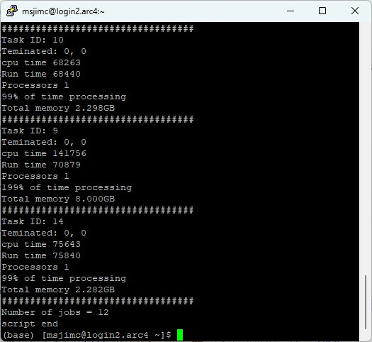

# b_qacct_2.sh
This script requests the resource usage data for an SGE qsub script that has completed and displays the taskID for array submissions, memory usage, CPU time, wall clock time, failure data as well as exit codes.

This data is then displayed to make it easy to see if a script/job finished OK, was cancelled due to requesting to much memory or over running the time requested. 

Its also possible to see how much of the available processing power was used. This calculated by:

> processing efficiency = number of processors * cpu time * 100 / wall clock time

If you request 5 processors (slots) and the job ran for 1 hour (3,600 sec) and used 3 hours (10,800 sec) of cpu time the job efficiency is:

(10800 * 100) / (3600 * 5) = 60%

This means that you only used the equivalent of 3 processors, and for most of the job 2 processors were doing nothing. This may because the job does a number of things, some cpu intensive other less so and you may be better off spliting the script up in to smaller scripts. This means that with reduced resources requested for the scripts submitted and they get to the front of the queue sooner. Alternatively, if the job is IO intensive it may be that it is waiting for a file to become readible. Sometimes several processors are sat waiting for another to finish its read/write tasks and rather than more procoessors making it quicker the script is slower as most of the threads(processors) are dead locked by the others. Less processors for read write intensive jobs may be quicker than more.

Usage:

bash b_qacct_2.sh \<job ID>

|Parameter|Comment|
|-|-|
|bash|indicates the script is a bash script|
|b_qacct_2.sh|The name (with path) of the script file|
|\<job ID>|The qsub/SGE job ID for the task|

Typical out put for b_qacct_2.sh reporting on a job array. (**Note:** task 9 seems to have 199% cpu efficiency and used 4 x the memory of the others, this is what the system reported rather than the script been wrong!)

